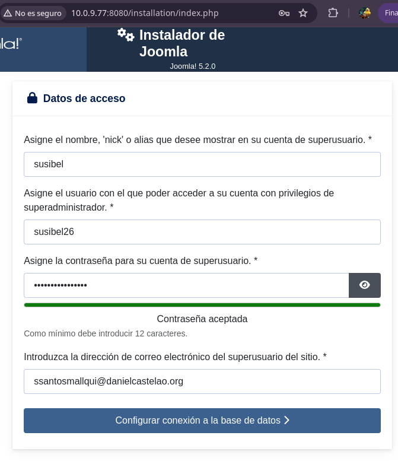

# Tarea07-SXE

## Creación de un docker compose con las imagenes de Joomla y Mysql. 
Para ello nos dirigimos al directorio donde lo queremos crear y con el siguiente comando vamos a escribir nuestro documento "docker-compose.yml":

``nano /home/Compose2/docker-compose.yml``

- Vamos a escribir los servicios que vamos a usar (Joomla y base de datos: Mysql).

- Vamos a poner en cada servicio la imagen que vamos a descargar en el contenedor, joomla y mysql respectivamente.

- Luego vamos a especificar que el contenedor se reinicie siempre al terminar la ejecución cuando da error.

- En el servidor Joomla vamos a especificar el puerto donde exponemos el contenedor.

- En "environment" para cada servidor es distinto y según a lo que querramos especificar y necesitar para ejecutar el contenedor. En Joomla, vamos a escribir las variables de HOST, usuario, contraseña que usaremos en la base de datos para este y opcionalmente podemos agregar también el usuario, contraseña y correo de administración para Joomla.
En el servidor de la base de datos vamos a especificar las variables de la database, la contraseña del root, el usuario y contraseña de la BD.

- Luego añadimos los volumenes en cada servidor, con las rutas especificadas para indicar qué carpeta queremos que sean copiadas de local a nuestro contenedor.

- Ya casi para terminar vamos a agregar la sección de volumes donde pondremos la referencia de las carpetas de cada servidor. Esto permitirá que otros contenedores pueda acceder al mismo volumen de nuestro compose.

Luego vamos a ejecutar nuestro docker-compose con el siguiente comando:

``docker-compose up -d``

Luego de que se desacargue las iamgenes y cree los contenedores, podremos confirmar si todo ah saldio correctamente, accediento desde el navegador con nuestro ip y el puerto especificado en el compose: https://10.0.9.77:8080  

  
Comprobación

   
  

### Comprobamos la ejecución del docker-compose
Para instalar Joomla simplemente especificamos los datos que nos pidan. En datos de acceso vamos a especificar los datos de administrador que pusimos en el docker-compose.

  
Datos de Acceso

   
  

En la parte de la base de datos, debemos prestar atención ya que debemos escribir los datos exactamente igual a como estan en el servidor Joomla del docker-compose.

  
Configuración de la base de datos

   
  

Si todo es correcto nos saldra un mensaje:

  
Mensaje

   
  

## Añadimos phpMyAdmin a nuestro docker-compose
Vamos añadir nuestro a nuestro documento "docker-compose.yml" el servidor PHP. Para ello vamos al directorio donde esta nuestro documento y editamos el archivo.

``nano /home/Compose2/docker-compose.yml``

Vamos a especificar al igual que los anteriores servidores la imagen, el puerto, el entorno (environment), el volumen, con el volumen vamos a usar el mismo que la base de datos ya que PHP trabaja con este.

Luego de guardar los cambios del archivo yaml. Vamos a ejecutar nuevamente el docker-compose con el comando:

``docker-compose up -d``

Esta vez se descargará solo la iamgen de phpMyAdmin en un contenedor. 

### Comprobamos la ejecución
Para comprobar que todo se haya descargado correctamente y la ejecución es un éxito vamos a ir al navegador y pondremos nuestro ip con el puerto especifico de PHP https://10.0.9.77:8081 

  
phpMyAdmin

   
  

Luego introducimos los datos de nuestra base de datos mysql, accediendo a la página principal de nuestro phpMyAdmin.

  
Index

   
  

Eso seria todo.
